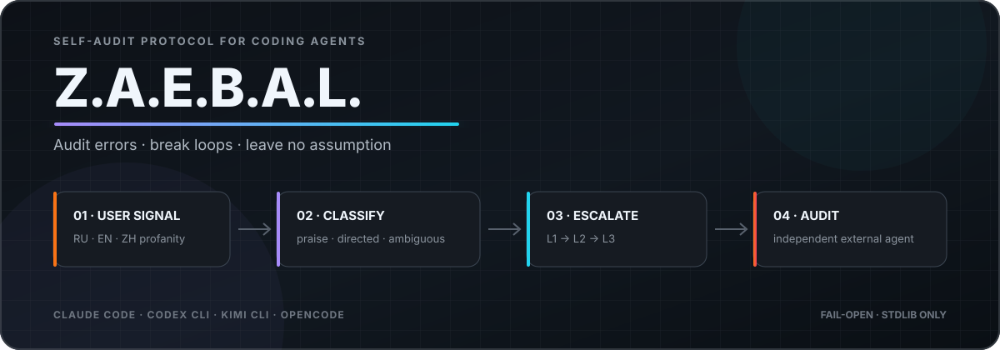

<div align="center">



<h3>
<strong>Z</strong>aebal? · <strong>A</strong>udit · <strong>E</strong>rrors ·
<strong>B</strong>reak · <strong>A</strong>nalyze · <strong>L</strong>eave no assumption
</h3>

<p>
<strong>Читать на других языках</strong><br>
<a href="README.md">🇺🇸 English</a> ·
<a href="README.ru.md">🇷🇺 Русский</a> ·
<a href="README.zh-CN.md">🇨🇳 简体中文</a>
</p>

<p>


</p>

<p>
<strong>Самоаудит кодинг-агентов, который запускается по сигналу ругани пользователя.</strong><br>
Z.A.E.B.A.L. воспринимает раздражение пользователя как операционный сигнал: остановиться,
перепроверить убеждения агента и при повторных ошибках передать сессию независимому
аудитору.
</p>

<p>
<a href="#карта-возможностей">Возможности</a> ·
<a href="#как-это-работает">Как это работает</a> ·
<a href="#установка">Установка</a> ·
<a href="#настройка">Настройка</a> ·
<a href="#архитектура">Архитектура</a>
</p>

</div>

---

## Зачем это нужно

Когда кодинг-агент зацикливается, он часто повторяет одно действие с небольшими
вариациями. Причина обычно не в невнимательности, а в одном неверном убеждении о задаче
или кодовой базе. Агент продолжает считать его фактом, поэтому очередная самопроверка
может воспроизвести ту же ошибку.

Z.A.E.B.A.L. добавляет feedback loop на границе пользовательского сообщения:

- мат и прямые претензии становятся сигналом аудита;
- похвала матом вроде «заебись, работает» остаётся без вывода и не увеличивает стрик,
  но не разрешает возобновить мутации после стопа уровня 3;
- повторные сигналы повышают строгость протокола вплоть до полного стопа;
- на уровне 3 hook пытается запустить технически read-only внешний аудит;
- на уровне 3 мутации возобновляются только после явного подтверждения пользователя.

Аудит оспаривает трактовку агента и не фиксирует контракт задачи. Он требует факт,
способный опровергнуть объяснение, конкретное изменение следующего действия и проверку
именно заявленной проблемы. При повторе нужно проверить предыдущий аудит, даже без
нового мата или после сброса/истечения стрика. «Продолжай» разрешает продолжение, но
не доказывает исправление. См. [обезличенные примеры](skills/zaebal/references/recovery-examples.md).

Текущая версия не устанавливает техническую блокировку инструментов. Протокол меняет
инструкции агента и требует остановиться; окончательный контроль остаётся у человека.

### Возможность технического mutation lock

Исследование от 2026-07-31 показало, что блокирующий STOP мутаций технически возможен
во всех четырёх адаптерах, но с разными гарантиями:

| Хост | Блокирующий механизм | Вывод и ограничение |
|---|---|---|
| Claude Code | [`PreToolUse`](https://code.claude.com/docs/en/hooks) может запретить `Bash`, edit/write и MCP-вызовы. | **Да.** Exit `2` или structured `deny` блокирует до выполнения; настройки hook остаются под контролем хоста/пользователя. |
| Codex | [`PreToolUse`](https://learn.chatgpt.com/docs/hooks.md) может запретить Bash, `apply_patch`, MCP и локальные function tools. | **Да, широкое покрытие.** Из-за исключений coverage это guardrail, а не абсолютный sandbox. |
| Kimi CLI | [`PreToolUse`](https://www.kimi.com/code/docs/en/kimi-code-cli/customization/hooks.html) блокирует через exit `2` или structured `deny`. | **Да, fail-open.** Ошибка, crash или timeout hook пропускает операцию. |
| OpenCode | [`tool.execute.before`](https://opencode.ai/docs/plugins/) может отклонить tool call, а [`permission`](https://opencode.ai/docs/permissions/) — запретить edit и shell. | **Да.** Надёжный lock должен сочетать state протокола с permissions хоста, а не полагаться только на исключение plugin. |

Lock и state machine пока не добавляются: сначала текстовые исправления и журнал
инцидентов должны показать, что дисциплинарного STOP действительно недостаточно.

## Карта возможностей

| Возможность | Что происходит | Реализация |
|---|---|---|
| Мультиязычный детектор | Распознаёт русский, английский и китайский мат, включая разделение знаками и распространённый leetspeak. | `core/wordlists/{ru,en,zh}.txt` + NFKC-нормализация |
| Классификация намерения | До изменения стрика отделяет похвалу, адресную претензию и неоднозначную ругань. | `classify()`; веса `0`, `1.0` и `0.5` |
| Сессионная эскалация | Хранит стрик каждой сессии в скользящем окне 30 минут и выбирает L1, L2 или L3. | Атомарный JSON-state + нативная блокировка `fcntl` / `msvcrt` |
| Три протокола аудита | Инжектит всё более строгие инструкции: независимые проверки, инвентаризацию убеждений и полный стоп. | `core/protocol/L1.md` → `L3.md` |
| Session-first evidence | Требует от рабочего агента и двух внутренних аудиторов прочитать хронологию, найти первую точку расхождения и сопоставить её с diff и коммитами по времени. | Locator в начале; фрагмент истории только при отсутствии файла-источника |
| Внешний аудитор | Запускает CLI того же или другого вендора с источником истории, ориентационным фрагментом и фактами репозитория. | Claude, Codex, Kimi или OpenCode |
| Четыре адаптера | Перехватывает отправку сообщения в Claude Code, Codex CLI, Kimi CLI и OpenCode. | JSON hooks, TOML hook или TypeScript plugin |
| Явное продолжение | Сбрасывает эмоциональный стрик после `продолжай`, `согласен` или `по плану`; не означает, что проблема решена. | Существующий state каждой сессии |
| Метаданные инцидентов | Пишет события trigger, auditor, verdict и ack без содержимого сообщений. | `~/.zaebal/incidents.jsonl` |
| Fail-open | Ошибки не блокируют сессию хоста. Сбой записи trigger/state и телеметрии виден; несохранённому trigger не выдаётся токен отката. | Exit `0`; обнаруженные ошибки записи и аудитора попадают в контекст |

## Как это работает

```text
Сообщение пользователя
    │
    ▼
Адаптер хоста
UserPromptSubmit / chat.message
    │
    ▼
core/zaebal.py
normalize → detect → classify
    │
    ├─ clean / praise ──────────────────────────────► тишина
    │
    └─ directed (+1.0) / ambiguous (+0.5)
                         │
                         ▼
                  стрик сессии
                         │
              ┌──────────┼──────────┐
              ▼          ▼          ▼
             L1         L2         L3
              │          │          ├─ внешний аудитор
              └──────────┴──────────┴─ протокол в контекст агента
```

### Уровни эскалации

| Уровень | Вес стрика | Поведение агента | Внешний аудитор |
|---|---:|---|---|
| **L1** | `0.5–1.5` | Прочитать историю, найти первую точку расхождения, провести два независимых внутренних аудита и подготовить микро-план. | Опционально |
| **L2** | `2–3.5` | Повторно прочитать хронологию, запустить двух свежих аудиторов, проверить прошлый вывод и исходный запрос. | По умолчанию выключен |
| **L3** | `4+` | Остановить всю неаудиторскую работу; провести два внутренних и настроенный внешний аудит, сопоставить стрик с Git-хронологией и ждать подтверждения. | По умолчанию предпринимается; unsafe built-ins отклоняются |

Адресная претензия добавляет `1.0`, ругань без обнаруженного адресата — `0.5`. Окно
стрика составляет 30 минут. Спокойный вопрос и похвала его не сбрасывают. Сброс даёт
только явное подтверждение продолжения.

## Установка

Для установки агентом под Linux или Windows начните с раздела установки в
[`skills/zaebal/SKILL.md`](skills/zaebal/SKILL.md). Агент читает только инструкцию
ОС целевого процесса и подключает хук выбранного хоста один раз. Общее ядро —
Python 3.10+ без pip-зависимостей. Windows не требует WSL/Bash, Linux — PowerShell.
Новый помощник подключения поддерживает Codex и Claude Code на обеих ОС;
существующие Linux-адаптеры Kimi и OpenCode сохранены. Их native-Windows
поддержка здесь не заявлена.
Короткая проверка команды выполняется с временными настройками; подтверждение
загрузки хука реальным хостом проверяется отдельно.

Требования:

- `python3`; ядро использует только стандартную библиотеку;
- хотя бы один поддерживаемый агентский CLI, если включён внешний аудит.

Из корня репозитория:

```bash
chmod +x install.sh
./install.sh
```

Инсталлятор находит доступные хосты, копирует ядро в `~/.zaebal/` и меняет только
соответствующие пользовательские конфиги:

| Хост | Интеграция | Команда аудитора по умолчанию |
|---|---|---|
| Claude Code | `UserPromptSubmit` в `~/.claude/settings.json` | `claude -p` только с `Read,Grep,Glob` |
| Codex CLI | `UserPromptSubmit` в `~/.codex/hooks.json` | `codex exec --sandbox read-only` |
| Kimi CLI | hook-блок в `$KIMI_CODE_HOME/config.toml`, если задано, иначе в `~/.kimi-code/config.toml` | `kimi -p` (unsafe opt-in) |
| OpenCode | plugin в `~/.config/opencode/plugins/zaebal.ts` | `opencode run` (unsafe opt-in) |

Установка идемпотентна: старые hook-записи Z.A.E.B.A.L. заменяются, а посторонние
настройки и `~/.zaebal/config.json` сохраняются. После установки перезапустите активные
агентные сессии.

## Проверка

Запустите ядро напрямую, не затрагивая обычный state:

```bash
echo '{"session_id":"demo","prompt":"ты меня заебал"}' \
  | ZAEBAL_STATE_DIR="$(mktemp -d)" python3 core/zaebal.py --host kimi
```

В выводе должен появиться `<zaebal level="1">`.

Похвала матом должна остаться без вывода:

```bash
echo '{"session_id":"demo-praise","prompt":"заебись, работает"}' \
  | ZAEBAL_STATE_DIR="$(mktemp -d)" python3 core/zaebal.py --host kimi
```

Для проверки того, что Kimi реально потребляет hook (а не только принимает
TOML), без обращения к model backend:

```bash
scripts/kimi-host-canary.sh
```

Canary использует изолированный `KIMI_CODE_HOME`, передаёт реальный
content-part prompt и блокирует turn на `UserPromptSubmit`. При заданном
`KIMI_CODE_HOME` инсталлятор создаёт и использует этот каталог вместо
`~/.kimi-code`.

## Настройка

Напишите `zaebal` в чате агента, чтобы открыть настройки. Установка по GitHub-ссылке
и обсуждение названия скилла не запускают аудит. Команды используют общий core
в Claude Code, Codex, Kimi CLI и OpenCode:

| Команда в чате | Действие |
|---|---|
| `zaebal` / `zaebal config` | Показать настройки без аудита |
| `zaebal auto off` / `zaebal auto on` | Выключить / включить автоматическую реакцию на ругань |
| `zaebal manual off` / `zaebal manual on` | Выключить / включить аудит по явному запросу |
| `zaebal off` / `zaebal on` | Выключить / включить оба способа запуска |
| `zaebal audit` | Запустить один ручной аудит без увеличения стрика |

Настройки доступны и при выключенных триггерах. Русское `заебал` без контекста
остаётся возможной жалобой; для управления используйте латинское `zaebal`.
Нативные вызовы скилла ведут в тот же режим:
[Claude Code](https://code.claude.com/docs/en/skills) — `/zaebal`,
[Codex](https://learn.chatgpt.com/docs/build-skills) — `$zaebal`,
[Kimi](https://moonshotai.github.io/kimi-cli/en/customization/skills.html) — `/skill:zaebal`;
в [OpenCode](https://opencode.ai/docs/skills) попросите агента использовать `zaebal`.
Без активного hook скилл использует `python3 ~/.zaebal/core/zaebal.py --control status`
или `--control auto off` / `--control manual off`. Для Kimi установщик также кладёт
копию в `~/.kimi/skills/zaebal/`, чтобы другой общий каталог skills не скрывал её.

Дефолты лежат в [`core/config.json`](core/config.json). Пользовательские
переопределения — в `~/.zaebal/config.json`; они общие для всех хостов
и подхватываются на следующем сообщении:

```json
{
  "auto_trigger": true,
  "manual_trigger": true,
  "auditor": "same",
  "audit_levels": [3],
  "auditor_timeout_sec": 90,
  "auditor_command": "",
  "allow_unsafe_auditor": false,
  "transcript_tail_chars": 12000,
  "agent_context_tail_chars": 2500
}
```

| Ключ | По умолчанию | Назначение |
|---|---|---|
| `auto_trigger` | `true` | Автоматическая реакция на ругань и неявный запуск аудита самим скиллом. |
| `manual_trigger` | `true` | Аудит по явному запросу. Настройки и справка остаются доступны при false. |
| `auditor` | `"same"` | Тот же вендор, конкретный `kimi` / `claude` / `codex` / `opencode` или `"none"`. Встроенный Kimi/OpenCode-аудит без unsafe opt-in явно деградирует. |
| `audit_levels` | `[3]` | Уровни, на которых синхронно вызывается внешний аудитор. `[2, 3]` включает его раньше. |
| `auditor_timeout_sec` | `90` | Максимальное время ожидания ответа аудитора. |
| `auditor_command` | `""` | Пользовательская команда; audit prompt добавляется последним аргументом. |
| `allow_unsafe_auditor` | `false` | Разрешить встроенный Kimi/OpenCode-аудитор без enforced read-only режима. Предпочтительнее Claude/Codex или sandboxed `auditor_command`. |
| `transcript_tail_chars` | `12000` | Максимальный ориентационный фрагмент для аудитора; канонической историей остаётся доступный файл transcript. |
| `agent_context_tail_chars` | `2500` | Максимальный фрагмент при отсутствии читаемого transcript. Иначе в начале инъекции передаётся locator, и агенты читают источник напрямую. |

Пример: Claude проверяет сессию Codex.

```json
{
  "auditor": "claude"
}
```

## Архитектура

```text
zaebal/
├── core/
│   ├── zaebal.py          # детектор, state, эскалация, транскрипт и аудитор
│   ├── config.json        # дефолтная runtime-конфигурация
│   ├── protocol/          # L1.md, L2.md, L3.md
│   └── wordlists/         # ru.txt, en.txt, zh.txt
├── adapters/
│   ├── claude-code/       # пример JSON hook
│   ├── codex/             # пример JSON hook
│   ├── kimi-cli/          # TOML hook-блок
│   └── opencode/          # plugin chat.message
├── skills/zaebal/         # протокол и справка настроек для агента
├── tests/                 # unit- и end-to-end тесты контракта
├── install.sh             # идемпотентная интеграция с хостами
└── uninstall.sh           # удаление hooks и backup конфига
```

Python-ядро — единственный источник runtime-поведения. Адаптеры лишь переводят события
хоста в общий JSON-контракт и инжектят непустой stdout обратно в контекст агента.

Runtime-state хранится в `~/.zaebal/`:

```text
~/.zaebal/
├── core/          # установленная копия
├── config.json    # опциональные пользовательские настройки
├── state.json     # взвешенная история триггеров по сессиям
├── incidents.jsonl # события trigger и ack без содержимого сообщений
├── transcripts/opencode/ # приватные текстовые snapshots для аудита OpenCode
└── state.lock     # нативная блокировка параллельных hooks
```

Аудиторский subprocess получает `ZAEBAL_INTERNAL=1`, поэтому глобально установленный
hook не реагирует на дословную ругань внутри собственного audit prompt.

## Тесты

```bash
cd tests
python3 -m unittest test_zaebal -v
```

Тесты покрывают нормализацию, RU/EN/ZH-детектор, мета-упоминания, похвалу, взвешенную
эскалацию, конкурентную запись state, телеметрию, переносимые пути установщика,
подтверждения, anti-recursion, sandbox-аргументы аудиторов, ошибки и end-to-end
инъекцию протокола.

## Известные ограничения

- Детектор эвристический: сарказм и необычный контекст могут дать ложное срабатывание
  или пропуск.
- Детектор не распознаёт зацикливание действий без мата; общий loop detector был бы
  отдельным продуктом со своей моделью false positive.
- Интеграция хоста на native Windows проверена для Codex и Claude Code; адаптеры
  остальных хостов требуют отдельной проверки. State защищён нативной блокировкой
  `fcntl` / `msvcrt`.
- Встроенные аудиторы Kimi и OpenCode не имеют enforced read-only режима и по умолчанию
  отклоняются. `allow_unsafe_auditor: true` — явный unsafe opt-in.
- При обнаруженном trigger OpenCode-адаптер сохраняет текстовый snapshot сообщений сессии
  с правами `0600` в `~/.zaebal/transcripts/opencode/`; snapshots остаются до uninstall
  или ручной очистки.
- Внешний аудит синхронный: на включённых уровнях пользователь ждёт ответ или timeout.

## Удаление

```bash
./uninstall.sh
```

Hooks, OpenCode plugin, установленные skills и `~/.zaebal/` удаляются. Если существует
пользовательский конфиг, перед удалением он копируется в
`~/zaebal-config.backup.json`.
