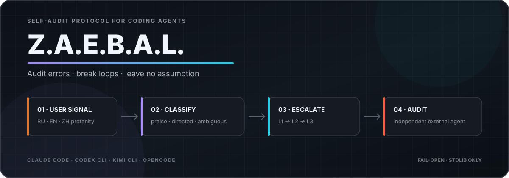

<div align="center">



<br><br>

<strong>其他语言版本</strong>

<br>

<a href="README.md">🇺🇸 English</a> ·
<a href="README.ru.md">🇷🇺 Русский</a> ·
<a href="README.zh-CN.md">🇨🇳 简体中文</a>

<br><br>


<br><br>

<strong>由用户粗口与直接抱怨触发的编程智能体自审计。</strong>

<br><br>

Z.A.E.B.A.L. 把用户的明显不满视为操作信号：停止当前路线、重新检查智能体的
基本假设，并在错误反复出现时把会话交给独立审计智能体。

<br><br>

<a href="#功能地图">功能</a> ·
<a href="#工作原理">工作原理</a> ·
<a href="#安装">安装</a> ·
<a href="#配置">配置</a> ·
<a href="#架构">架构</a>

</div>

---

**Z**aebal? **A**udit. **E**rrors. **B**reak. **A**nalyze.
**L**eave no assumption.

## 为什么需要它

当编程智能体陷入循环时，它往往会用细微变体重复同一个动作。问题通常不是
“不够仔细”，而是它对任务或代码库持有一个错误假设，并继续把这个假设当作事实。
因此，再做一次相同视角的自检，很可能只会复制原来的错误。

Z.A.E.B.A.L. 在用户消息入口加入反馈闭环：

- 粗口和直接抱怨会成为审计信号；
- “fucking great” 这类带粗口的正面评价不会增加连续权重；如果已有事件，则会把它
  作为确认并关闭；
- 信号反复出现时，协议会逐级升级，最终要求完全停止；
- 在 L3，外部智能体会读取会话记录和仓库证据；
- 只有用户明确确认后，工作才会继续。

系统有意不对工具做技术封锁。协议通过上下文要求智能体停止，最终控制权始终
留在用户手中。

## 功能地图

| 功能 | 行为 | 实现 |
|---|---|---|
| 多语言检测 | 检测俄语、英语和中文粗口，包括标点拆分与常见字符替换。 | `core/wordlists/{ru,en,zh}.txt` + NFKC 标准化 |
| 意图分类 | 在修改连续触发状态前，区分正面评价、定向抱怨与不明确的情绪表达。 | `classify()`；权重 `0`、`1.0`、`0.5` |
| 会话级升级 | 在 30 分钟滑动窗口内按会话记录信号，并选择 L1、L2 或 L3。 | 原子 JSON 状态 + POSIX `fcntl` 锁 |
| 三层审计协议 | 注入逐渐严格的指令：独立检查、假设清单与完全停止。 | `core/protocol/L1.md` → `L3.md` |
| 外部审计智能体 | 使用同厂商或跨厂商 CLI 检查会话尾部与仓库证据。 | Claude、Codex、Kimi 或 OpenCode |
| 四个宿主适配器 | 在 Claude Code、Codex CLI、Kimi CLI 与 OpenCode 提交用户消息时触发。 | JSON hooks、TOML hook 或 TypeScript plugin |
| 明确恢复机制 | 只有收到 `continue`、`продолжай` 或 `по плану` 等确认才关闭事件。 | 每个会话独立的状态生命周期 |
| Fail-open 安全 | 错误 payload、缺失审计器、超时或内部异常都不会破坏宿主会话。 | 静默退出码 `0`；审计错误写入上下文 |

## 工作原理

```text
用户消息
    │
    ▼
宿主适配器
UserPromptSubmit / chat.message
    │
    ▼
core/zaebal.py
normalize → detect → classify
    │
    ├─ clean / praise ──────────────────────────────► 静默
    │
    └─ directed (+1.0) / ambiguous (+0.5)
                         │
                         ▼
                    会话连续状态
                         │
              ┌──────────┼──────────┐
              ▼          ▼          ▼
             L1         L2         L3
              │          │          ├─ 外部审计智能体
              └──────────┴──────────┴─ 协议注入上下文
```

### 升级级别

| 级别 | 连续权重 | 智能体行为 | 外部审计 |
|---|---:|---|---|
| **L1** | `1–1.5` | 停止，执行两次独立检查，列出假设并准备微型计划。 | 可选 |
| **L2** | `2–3.5` | 移除未经验证的假设，并把当前工作与原始需求逐项比较。 | 默认关闭 |
| **L3** | `4+` | 停止所有智能体与后台任务，向用户展示错误假设、证据和偏差。 | 默认开启 |

定向抱怨增加 `1.0`，没有检测到对象的粗口增加 `0.5`。窗口为 30 分钟。普通问题
不会重置状态；真正的正面评价或明确确认会重置。

## 安装

要求：

- `python3`；核心只使用 Python 标准库；
- 如果启用外部审计，至少需要一个受支持的智能体 CLI。

在仓库根目录运行：

```bash
chmod +x install.sh
./install.sh
```

安装器会检测可用宿主，把核心复制到 `~/.zaebal/`，并只更新对应的用户配置：

| 宿主 | 集成方式 | 默认审计命令 |
|---|---|---|
| Claude Code | `~/.claude/settings.json` 中的 `UserPromptSubmit` | `claude -p`，仅允许 `Read,Grep,Glob` |
| Codex CLI | `~/.codex/hooks.json` 中的 `UserPromptSubmit` | `codex exec --sandbox read-only` |
| Kimi CLI | `~/.kimi-code/config.toml` 中的 hook 区块 | `kimi -p` |
| OpenCode | `~/.config/opencode/plugins/zaebal.ts` plugin | `opencode run` |

安装过程可重复执行：旧的 Z.A.E.B.A.L. hook 会被替换，其他设置以及
`~/.zaebal/config.json` 会保留。安装后请重启当前智能体会话。

## 验证

直接运行核心，并使用临时状态目录：

```bash
echo '{"session_id":"demo","prompt":"你这个傻逼又弄坏了"}' \
  | ZAEBAL_STATE_DIR="$(mktemp -d)" python3 core/zaebal.py --host kimi
```

输出应包含 `<zaebal level="1">`。

正面评价应保持静默：

```bash
echo '{"session_id":"demo-praise","prompt":"this is fucking great"}' \
  | ZAEBAL_STATE_DIR="$(mktemp -d)" python3 core/zaebal.py --host kimi
```

## 配置

默认值位于 [`core/config.json`](core/config.json)。用户覆盖配置位于
`~/.zaebal/config.json`，下一次触发时自动加载：

```json
{
  "auditor": "same",
  "audit_levels": [3],
  "auditor_timeout_sec": 90,
  "auditor_command": "",
  "transcript_tail_chars": 12000
}
```

| 键 | 默认值 | 含义 |
|---|---|---|
| `auditor` | `"same"` | 与宿主相同的厂商、指定 `kimi` / `claude` / `codex` / `opencode`，或 `"none"`。 |
| `audit_levels` | `[3]` | 同步调用外部审计器的级别；使用 `[2, 3]` 可以更早审计。 |
| `auditor_timeout_sec` | `90` | 等待审计结果的最长秒数。 |
| `auditor_command` | `""` | 自定义命令；审计 prompt 会作为最后一个参数加入。 |
| `transcript_tail_chars` | `12000` | 发送给审计器的最大会话尾部字符数。 |

示例：让 Claude 审计 Codex 会话。

```json
{
  "auditor": "claude"
}
```

## 架构

```text
zaebal/
├── core/
│   ├── zaebal.py          # 检测、状态、升级、会话记录与审计器
│   ├── config.json        # 默认运行时配置
│   ├── protocol/          # L1.md、L2.md、L3.md
│   └── wordlists/         # ru.txt、en.txt、zh.txt
├── adapters/
│   ├── claude-code/       # JSON hook 示例
│   ├── codex/             # JSON hook 示例
│   ├── kimi-cli/          # TOML hook 区块
│   └── opencode/          # chat.message plugin
├── skills/zaebal/         # 面向智能体的协议与配置参考
├── tests/                 # unit 与 end-to-end 合约测试
├── install.sh             # 可重复执行的宿主集成
└── uninstall.sh           # 移除 hook 并备份配置
```

Python 核心是运行时行为的唯一来源。宿主适配器只负责把各自事件转换为统一 JSON
合约，并把非空 stdout 注入回智能体上下文。

运行时状态位于 `~/.zaebal/`：

```text
~/.zaebal/
├── core/          # 已安装的核心副本
├── config.json    # 可选用户覆盖配置
├── state.json     # 按会话保存的加权触发历史
└── state.lock     # 并发 hook 使用的 POSIX 锁
```

审计子进程会收到 `ZAEBAL_INTERNAL=1`，因此全局 hook 不会被审计 prompt 中引用的
用户粗口再次触发。

## 测试

```bash
cd tests
python3 -m unittest test_zaebal -v
```

测试覆盖标准化、RU/EN/ZH 检测、误报、正面评价、加权升级、并发状态写入、用户确认、
防递归、审计器 sandbox 参数、失败处理，以及端到端协议注入。

## 已知限制

- 检测器采用启发式规则；讽刺和特殊上下文仍可能造成误报或漏报。
- 检测器支持 RU/EN/ZH 输入，但当前注入的 L1–L3 协议和外部审计 prompt 使用俄语。
- 状态锁使用 POSIX `fcntl`；Windows 上的并发 hook 可能丢失更新。
- Kimi 与 OpenCode 的审计命令不会被 Z.A.E.B.A.L. 技术性地 sandbox；它们依赖
  审计 prompt 以及宿主中已有的限制。
- 外部审计是同步的；在启用的级别上，用户需要等待审计结果或超时。

## 卸载

```bash
./uninstall.sh
```

该命令会移除 hooks、OpenCode plugin、已安装 skills 和 `~/.zaebal/`。如果存在
用户配置，会先备份到 `~/zaebal-config.backup.json`。
